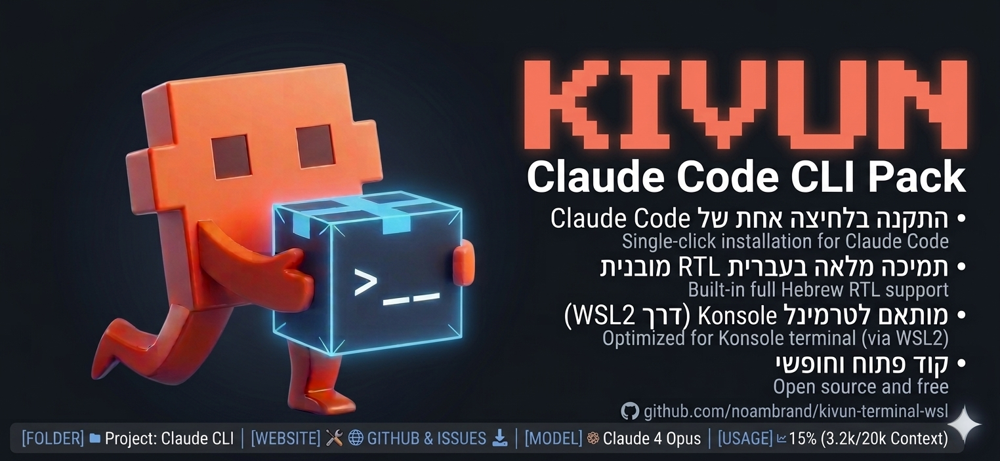
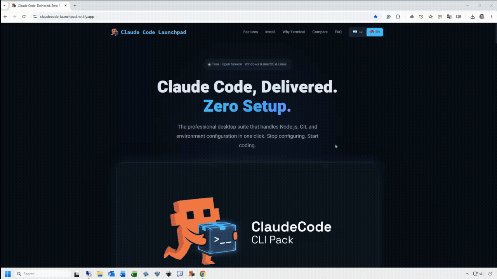
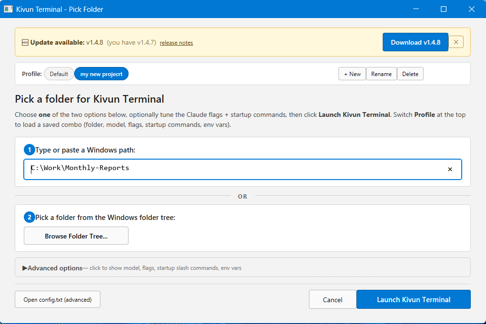

<p align="center">
  
</p>

<p align="center">
  
</p>

<p align="center">
  <video src="https://github.com/noambrand/kivun-terminal-wsl/releases/latest/download/Kivun_Terminal_v1.4.13.mp4" width="700" controls muted playsinline></video>
</p>

<p align="center">
  <em>📹 Demo: Hebrew Claude Code session inside Kivun Terminal -
  <a href="https://github.com/noambrand/kivun-terminal-wsl/releases/latest/download/Kivun_Terminal_v1.4.13.mp4">download MP4 (2.4 MB)</a>
  if your browser doesn't autoplay above.</em>
</p>

<p align="center">
  <a href="LICENSE"></a>
  <a href="https://github.com/noambrand/kivun-terminal-wsl/releases/latest"></a>
  
  
  <a href="https://github.com/noambrand/kivun-terminal-wsl/stargazers"></a>
  
  
</p>

<p align="center">
  <a href="README.md"><b>English</b></a> &bull;
  <a href="README.md#%D7%A2%D7%91%D7%A8%D7%99%D7%AA"><b>עברית</b></a> &bull;
  <b>العربية</b> &bull;
  <a href="README.fa.md"><b>فارسی</b></a>
</p>

<div dir="rtl">

<h3 align="center">واجهة طرفية حقيقية لـ Claude Code بدعم RTL. عبري، عربي، فارسي، أردو و8 لغات تانية - بتنعرض صح، على Windows و Linux.</h3>

<p align="center"><sub><strong>دعم macOS انتهى من الإصدار v1.2.4</strong> - مفيش هلق ولا واجهة طرفية أصلية على Mac بتعرض العبري والإنجليزي مخلوطين بشكل صحيح. <a href="mac/README.md">التفاصيل وتعليمات إزالة التثبيت ←</a></sub></p>

<p align="center">
  <a href="#quick-start">البداية السريعة</a> &bull;
  <a href="#why-kivun-terminal">ليش Kivun Terminal؟</a> &bull;
  <a href="#bidi-wrapper">BiDi Wrapper</a> &bull;
  <a href="#architecture">البنية</a> &bull;
  <a href="#configuration">الإعدادات</a> &bull;
  <a href="docs/CHANGELOG.md">سجل التغييرات</a> &bull;
  <a href="docs/TROUBLESHOOTING.ar.md">حل المشاكل</a>
</p>

---

> 💡 **بتشتغل بالإنجليزي بس (LTR)؟** جرّب المشروع الأخ **[ClaudeCode Launchpad CLI](https://github.com/noambrand/kivun-terminal)** - نفس فكرة المُشغّل، إقلاع أسرع (~2 ثانية)، وما بدك WSL. Kivun Terminal هو الخيار الصح لما بدك عرض RTL/BiDi للعبري، العربي، الفارسي وغيرهم.

## ليش Kivun Terminal؟ <a id="why-kivun-terminal"></a>

<table dir="rtl">
<thead>
<tr><th></th><th>Launchpad CLI</th><th>Kivun Terminal</th></tr>
</thead>
<tbody>
<tr><td><strong>نص عبري / عربي / فارسي محاذاة لليمين</strong></td><td>❌ بيطلع محاذي لليسار</td><td>✅ بيتحاذى لليمين متل ما لازم</td></tr>
<tr><td><strong>إنجليزي/كود مخلوط داخل جملة عبرية</strong></td><td>❌ الكلمات بتنزاح للحافة الغلط</td><td>✅ الكلمات بتنزل في المكان الصح بالجملة</td></tr>
<tr><td><strong>لغات RTL المدعومة</strong></td><td>0</td><td>11 (عبري، عربي، فارسي، أردو، باشتو، كردي، داري، أويغوري، سندي، يديش، سرياني)</td></tr>
<tr><td><strong>شريط حالة حي</strong> (الموديل، نسبة الـ context، الاستهلاك)</td><td>✅</td><td>✅</td></tr>
<tr><td><strong>ثيم Kivun بالأزرق الفاتح</strong></td><td>✅ Windows Terminal</td><td>✅ Konsole</td></tr>
<tr><td><strong>كبسة يمين "Open with…" على فولدر</strong></td><td>✅ Windows Explorer</td><td>✅ Windows Explorer + مدراء ملفات Linux</td></tr>
<tr><td><strong>برفايلز بأسماء لكل مشروع</strong> (فولدر + موديل + flags + متغيرات بيئة + slash-commands عند الإقلاع)</td><td>✅ v2.6.0 - صف chips فوق الـ picker، اضغط للتبديل؛ <code>ANTHROPIC_API_KEY</code> وغيره مخفي بالمعاينة افتراضياً</td><td>✅ <strong>🆕 v1.4.0</strong> - صف chips فوق الـ picker؛ <code>ANTHROPIC_API_KEY</code>/<code>DEBUG</code>/<code>MCP_*</code> لكل برفايل بتنتقل عبر <code>WSLENV</code>؛ مخفية بالمعاينة افتراضياً</td></tr>
<tr><td><strong>وقت الإقلاع</strong></td><td>~2 ثانية</td><td>~6 ثوان</td></tr>
<tr><td><strong>حجم التثبيت على Windows</strong></td><td>~150 MB</td><td>~2 GB (شامل Ubuntu + Konsole)</td></tr>
<tr><td><strong>دعم macOS</strong></td><td>✅</td><td>❌ انتهى من v1.2.4 (مفيش واجهة طرفية على Mac بتتعامل مع عبري+إنجليزي مخلوطين - شوف <a href="mac/README.md"><code>mac/README.md</code></a>)</td></tr>
<tr><td><strong>دعم Linux</strong></td><td>❌</td><td>✅ apt / dnf / pacman / zypper</td></tr>
</tbody>
</table>

> التفاصيل التقنية (BiDi wrapper، حقن RLM، حلول Konsole 23.x، إلخ) موجودة بباقي الـ README وفي [`docs/`](docs/) لأي حدا بدّو يعمّق.

<p align="center">
  <a href="https://github.com/noambrand/kivun-terminal-wsl/releases/latest/download/Kivun_Terminal_Setup.exe"></a>
  &nbsp;
  <a href="https://github.com/noambrand/kivun-terminal-wsl/releases/latest"></a>
</p>

## شو فيه جاهز من الصندوق

<p align="center">
  
</p>

<ul dir="rtl">
<li><strong>🆕 برفايلز بأسماء (v1.4.0+)</strong> - احفظ فولدر + موديل + flags + slash-commands الإقلاع + متغيرات بيئة لكل مشروع. صف الـ chips فوق الـ picker بيخليك تنقّل بين البرفايلز بكبسة وحدة؛ البرفايل الفعّال مظلّل أزرق. متغيرات البيئة لكل برفايل (<code>ANTHROPIC_API_KEY</code>، <code>DEBUG</code>، <code>MCP_*</code> مخصصة، …) بتمرّ عبر <code>WSLENV</code> على Windows / <code>export</code> على Linux لحتى توصل لجلسة Claude Code. القيم مخفية بمعاينة الأمر افتراضياً عشان أمان الـ screenshots؛ اضغط <code>👁 show values</code> للإظهار.</li>
<li><strong>دايلوغ اختيار الفولدر</strong> على اختصار سطح المكتب (الصورة فوق) - تصفّح شجرة الفولدرات <strong>أو</strong> اكتب/الصق مسار Windows، مع اختيار الموديل بالـ radio (Opus / Sonnet / Haiku)، وflag chips بكبسة وحدة (رد بالعبري، High effort، قبول تعديلات الملفات تلقائياً، Read-only، إلخ)، وtextarea لslash commands الإقلاع متل <code>/voicemode:converse</code>.</li>
<li><strong>كبسة يمين "Open with Kivun Terminal"</strong> على أي فولدر بـ File Explorer - بيقلع مباشرة على الفولدر هاد، ويتجاوز الـ picker.</li>
<li><strong>سطر حالة حي بسطرين</strong> أسفل كل جلسة Claude Code - الموديل، نسبة الـ context، إجمالي tokens، مدة الجلسة، واستهلاك الـ 5 ساعات / 7 أيام مع عدّ تنازلي للريسِت.</li>
<li><strong>اختر لون خلفية الطرفية</strong> لـ Konsole. أزرق Kivun الفاتح (<code>#C8E6FF</code>) افتراضياً؛ بدّله إلى <code>dark</code> أو <code>black</code> أو <code>white</code> أو <code>default</code> (ثيم الطرفية الخاص بك) أو أي لون HEX مثل <code>#1e1e2e</code> عبر <code>TERMINAL_COLOR=</code> في الإعدادات. يُختار لون النص تلقائياً لسهولة القراءة.</li>
<li><strong>BiDi wrapper</strong> بيصلّح أخطاء عرض العبري/العربي/الفارسي بالـ TUI تبع Claude Code (شوف <a href="#bidi-wrapper">BiDi Wrapper</a> تحت لسبع تصليحات محددة).</li>
<li><strong>بيثبّت كل شي تلقائياً</strong> - WSL2 + Ubuntu + Konsole + Node.js + Claude Code، على جهاز Windows نظيف. المثبّت بيسأل مرة وحدة وبيدبّر الباقي.</li>
</ul>

## البداية السريعة <a id="quick-start"></a>

### Windows

1. **[نزّل `Kivun_Terminal_Setup.exe`](https://github.com/noambrand/kivun-terminal-wsl/releases/latest/download/Kivun_Terminal_Setup.exe)** من آخر إصدار.
2. شغّله - اتبع المعالج. ما بدك صلاحيات admin.
3. اضغط دبل-كلك على اختصار **Kivun Terminal** على سطح المكتب ← اختار فولدر (تصفّح الشجرة أو الصق مسار Windows)، أو كبسة يمين على أي فولدر بـ File Explorer ← **Open with Kivun Terminal**.

أول إقلاع ممكن ياخد 5-10 دقايق - المثبّت بيجيب Ubuntu (WSL2)، Konsole، و Claude Code لحاله.

<details>
<summary>إذا صار شي غلط: WSL مش مثبّت / SAC بيحجب / تحذير SmartScreen</summary>

<ul dir="rtl">
<li><strong>WSL2 ناقص.</strong> إذا قالك المعالج <em>"WSL is not installed"</em>، افتح <strong>Terminal (Admin)</strong>، شغّل <code>wsl --install</code>، اعمل reboot، وشغّل المثبّت من جديد. هاي بتعمَل مرة وحدة لكل جهاز.</li>
<li><a id="windows-smartscreen"></a><strong>تحذير SmartScreen</strong> (<em>"Windows protected your PC"</em>): اضغط <strong>More info</strong> ← <strong>Run anyway</strong>. المثبّت مش موقّع؛ التحذير بيختفي لما تتراكم إشارة السمعة عند Microsoft من تنزيلات حقيقية.</li>
<li><strong>Smart App Control على Windows 11</strong> (الحجب الأصعب - <em>"Smart App Control blocked an app that may be unsafe"</em> مع زر <em>Ok</em> بس): SAC بيرفض التطبيقات غير الموقّعة كلياً. افتح <strong>Start</strong> ← دوّر على <strong>Smart App Control</strong> ← حطّه على <strong>Off</strong>. ما بتقدر تشغّل SAC من جديد بدون إعادة تثبيت Windows، فخلّيه off بس إذا مرتاح تشغّل تطبيقات تانية مش موقّعة.</li>
<li><strong>لسا عالق؟ ابعت تقرير بكبسة وحدة.</strong> نزّل <strong><a href="https://github.com/noambrand/kivun-terminal-wsl/releases/latest"><code>kivun-diagnostics.cmd</code></a></strong> من آخر إصدار (أو افتح <strong>"Kivun Diagnostics"</strong> من قائمة Start إذا التثبيت خلص) واضغط عليه دبل-كلك. بيحفظ <strong><code>Kivun-Report.txt</code></strong> على سطح المكتب - ابعتو بالإيميل لـ noambbb@gmail.com. ما بدّو صلاحيات admin، وما بينبعت شي تلقائياً.</li>
</ul>

</details>

### Linux

```bash
git clone https://github.com/noambrand/kivun-terminal-wsl.git
cd kivun-terminal-wsl
./linux/install.sh
```

بدعم apt (Debian/Ubuntu)، dnf (Fedora/RHEL)، pacman (Arch/Manjaro)، zypper (openSUSE). بيثبّت Konsole، Node.js، Git، Claude Code، الـ BiDi wrapper، وتكاملات الكبسة اليمين لـ Nautilus + Dolphin.

### macOS

**ما بنعد ندعم من v1.2.4.** مفيش واجهة طرفية أصلية على macOS بتعرض عبري + إنجليزي مخلوطين بشكل صحيح اليوم (Apple Terminal ما عندو محرك BiDi، iTerm2 3.6.x بيعكس العبري، و`bidi_enabled` تبع WezTerm نص-مكسور بالنصوص المخلوطة). للشغل بالعبري على Mac، استعمل جهاز Windows أو Linux. السياق الكامل، الأدلة، وتعليمات إزالة التثبيت بـ [`mac/README.md`](mac/README.md). مستخدمين v1.2.x على Mac لسا بيقدروا ينزّلوا الـ `.pkg` المُهمَل من [إصدار v1.2.3](https://github.com/noambrand/kivun-terminal-wsl/releases/tag/v1.2.3) للرجوع للخلف.

> أول تشغيل على Windows أو Linux بدّو اشتراك Claude Pro/Max أو [مفتاح Anthropic API](https://console.anthropic.com).

## شريط الحالة

شريط حالة حي بسطرين أسفل كل جلسة Claude Code - نفس `statusline.mjs` بييجي بكل الـ installers وبيتسجّل بـ `~/.claude/settings.json` تلقائياً:

> **MyProject** | 🟢 Sonnet 4.6 | Context 🟩🟩🟩🟩🟩⬜⬜⬜⬜⬜ 51% | tokens: 284K | 24:13
>
> Session 🟨🟨🟨🟨🟨🟨🟨🟨⬜⬜ 77% resets in 4h15m &nbsp;|&nbsp; Weekly 🟩🟩⬜⬜⬜⬜⬜⬜⬜⬜ 16% resets in 6d18h

<table dir="rtl">
<thead><tr><th>الحقل</th><th>شو بيعرض</th></tr></thead>
<tbody>
<tr><td><strong>الموديل</strong></td><td>موديل Claude الفعّال (مرمّز بالألوان: أخضر = Opus، أصفر = Sonnet/Haiku)</td></tr>
<tr><td><strong>Context</strong></td><td>نسبة نافذة الـ context المستهلكة (أخضر/أصفر/أحمر)</td></tr>
<tr><td><strong>Tokens</strong></td><td>مجموع input + output tokens بهالجلسة</td></tr>
<tr><td><strong>Session / Weekly</strong></td><td>نسبة حد الاستهلاك مع عدّ تنازلي للريسِت</td></tr>
</tbody>
</table>

## ثيم الواجهة الطرفية

ثيم ألوان مخصص **Kivun بالأزرق الفاتح** (خلفية `#C8E6FF`، نص غامق، cursor أزرق) بييجي مع كل installer وبيكون مفعّل افتراضياً:

<table dir="rtl">
<thead><tr><th>المنصة</th><th>شو بيتظبّط</th><th>الملف</th></tr></thead>
<tbody>
<tr><td>Windows (WSL+Konsole)</td><td><code>KivunTerminal.profile</code> + <code>ColorSchemeNoam.colorscheme</code></td><td><code>~/.local/share/konsole/</code> (داخل WSL)</td></tr>
<tr><td>Linux (Konsole)</td><td>نفس الـ profile + color scheme</td><td><code>~/.local/share/konsole/</code></td></tr>
</tbody>
</table>

غيّر اللون عبر `TERMINAL_COLOR=` بإعداداتك: ثيم بالاسم (`kivun` / `dark` / `black` / `white`)، أو `default` للإبقاء على ثيم الطرفية الخاص بك، أو لون HEX مثل `#1e1e2e`. يُختار لون النص تلقائياً لسهولة القراءة. يسري التغيير عند الإطلاق التالي (أغلق كل نوافذ Kivun المفتوحة أولاً).

## BiDi Wrapper <a id="bidi-wrapper"></a>

الإصدار v1.1.0 بيجيب wrapper اسمه `kivun-claude-bidi` على Node.js بيمرّر مخرجات Claude Code من خلال آلة حالات بتعمل سبع تصليحات تكميلية لمحدوديات Konsole المعروفة بـ BiDi. كل تصليح هون انضاف رد على باغ معيّن بيشوفه المستخدم بعرض العبري؛ مع بعض بيخلوا مخرجات الواجهة الطرفية المخلوطة عبري/إنجليزي تتصرف متل ما `<bdi>` بيخلّيها تتصرف بـ HTML.

<table dir="rtl">
<thead><tr><th>التصليح</th><th>شو بيعمل</th><th>بيحلّ</th><th>افتراضي</th></tr></thead>
<tbody>
<tr><td><strong>تغليف runs العبري بـ RLE/PDF داخل فقرات LTR</strong></td><td>بيلفّ كل run عبري بـ <code>U+202B</code> / <code>U+202C</code> <em>بس</em> لما الفقرة المحيطة LTR</td><td>العبري المضمَّن بإنجليزي بدّو علامة اتجاه صريحة؛ بدون هيك BiDi بيشوف حروف العبري متل أي جزء تاني من تدفق الـ LTR</td><td>on</td></tr>
<tr><td><strong>حقن RLM ببداية السطر</strong></td><td>بيحقن <code>U+200F</code> ببداية أي سطر أول حرف قوي فيه RTL</td><td>بيصلّح باغ السطر الأول <code>● שלום</code> اللي بيطلع LTR ([anthropics/claude-code#39881](https://github.com/anthropics/claude-code/issues/39881))</td><td>on</td></tr>
<tr><td><strong>إزالة الـ bullet</strong> (v1.1.8)</td><td>بيشيل الـ <code>●</code> من بداية أسطر bullet العبرية حتى أول حرف ظاهر بالسطر يكون عبري</td><td>Konsole 23.x بيصنّف <code>●</code> كـ neutral بيرسّخ الاتجاه؛ بدون الإزالة، الأسطر بتظل LTR حتى مع RLM ببداية السطر</td><td>on</td></tr>
<tr><td><strong>إزالة bidi controls الواردة</strong> (v1.1.9)</td><td>بيشيل علامات embedding (<code>U+202A</code>-<code>U+202E</code>) و isolate (<code>U+2066</code>-<code>U+2069</code>) من تدفق Claude؛ بيحافظ على LRM/RLM</td><td>بيوقف bidi controls اللي بيبعتها upstream من إنها تتراكم مع الـ RLM المحقون من الـ wrapper وتنتج تموضع غير حتمي</td><td>auto</td></tr>
<tr><td><strong>تسطيح الألوان على أسطر RTL</strong> (v1.1.10)</td><td>بيشيل تسلسلات ANSI SGR (<code>CSI...m</code>) من أي سطر أول حرف قوي فيه عبري حتى يصير السطر run وحدة من الخصائص</td><td>BiDi تبع Konsole بيشتغل بس داخل مناطق متصلة من الخصائص؛ تغييرات الألوان بتقسم الـ BiDi run و Qt بيموضع الأجزاء الناتجة غلط</td><td>on</td></tr>
<tr><td><strong>بدون أقواس RLE/PDF لكل run على أسطر RTL</strong> (v1.1.11)</td><td>لما السطر صار RTL أصلاً بفضل RLM ببداية السطر، بيتجاوز أقواس RLE/PDF لكل run عبري - بيخلّي UAX #9 يتعامل مع الاتجاه عبر السطر الكامل بخاصية وحدة</td><td>أقواس كل run <em>بحد ذاتها</em> بتعمل حدود لمناطق الخصائص؛ على أسطر فيها كذا run عبري مفصولين بـ runs LTR، كانت بتعيد إنشاء نفس مشكلة التموضع اللي v1.1.10 كان المفروض يصلّحها</td><td>off</td></tr>
<tr><td><strong>استبدال cursor-forward ← spaces على أسطر RTL</strong> (v1.1.16، <strong>تأكّد المستخدم إنّو شغّال</strong> نيسان 2026)</td><td>بيستبدل كل <code>\x1b[NC</code> cursor-forward CSI بـ N space حرفي على أسطر RTL. بصرياً مطابق (الـ cursor بيتحرك فوق خلايا مفترض إنها فاضية؛ والـ spaces بتنكتب بنفس الخلايا) بس بدون حد لمنطقة الخصائص</td><td>الـ TUI تبع Claude Code بيستخدم escapes cursor-forward بدل spaces حرفية بين كل كلمتين - مؤكَّد عبر التقاط <code>KIVUN_BIDI_DUMP_RAW=on</code> اللي بيّن <strong>306 cursor-forward CSIs بجلسة عبرية قصيرة وحدة</strong>. كل واحد منها كان بيقسم BiDi run تبع Konsole بنفس الطريقة اللي ألوان SGR كانت تعملها، بس بشكل غير مرئي. v1.1.10 مسك المقسّمات الملوّنة المرئية؛ v1.1.16 بيمسك مقسّمات cursor-forward غير المرئية</td><td>on (مربوط بنفس الـ flag <code>KIVUN_BIDI_FLATTEN_COLORS_RTL</code>)</td></tr>
</tbody>
</table>

**ليش هاد ما بينحلّ بالـ upstream:** Konsole ما عندو محرك BiDi حقيقي - بيمرّر مناطق الخصائص المتصلة لـ Qt's text layout، و Qt ما عندو فكرة وين الجزء الملوّن أو المقوّس أو الموضوع بـ cursor بينتمي منطقياً بالفقرة RTL المحيطة. هاد موثّق بـ [terminal-wg.pages.freedesktop.org](https://terminal-wg.pages.freedesktop.org/bidi/prior-work/terminals.html) واتأكد عملياً بفحوصات A/B بنيسان 2026 على Konsole 23.08.5. KDE ما طلّعوا أي إشارة على إنهم رح يغيّروه؛ شغل الـ wrapper إنّو يعطي Konsole بالضبط شو بيقدر يعرضه صح: run خصائص وحدة لكل سطر RTL.

**التنازلات:**
- تسطيح v1.1.10 بيخسّر ألوان الـ syntax على الأسطر العبرية. حط `KIVUN_BIDI_FLATTEN_COLORS_RTL=off` للحفاظ على الألوان مقابل تموضع مكسور. (استبدال cursor-forward بـ v1.1.16 مربوط بنفس الـ flag، فإذا تجنّبت تسطيح الألوان رح تتجنّب استبدال cursor-forward كمان.)
- خيار v1.1.11 بدون أقواس هو الطريق الأنظف؛ إذا بدك السلوك القديم تبع v1.1.0-v1.1.10 حط `KIVUN_BIDI_BRACKET_RTL_RUNS=on`.

**نمط الـ debugging "دوّر على مقسّمات CSI غير المرئية"** (درس v1.1.16 المتعلَّم، موثّق كمان بـ `docs/TROUBLESHOOTING.md`): لما مخرجات الواجهة الطرفية المعروضة من الـ wrapper بتطلع غلط حتى لما كل الـ escapes <em>المرئية</em> (ألوان، RLE/PDF) متشيّلة، دوّر على تسلسلات CSI <em>غير مرئية</em> عم تشتغل كحدود لمناطق الخصائص. cursor-forward (<code>...C</code>)، cursor-back (<code>...D</code>)، set/reset mode (<code>...h</code>/<code>...l</code>) كلهم مؤهلين. شغّل `KIVUN_BIDI_DUMP_RAW=on` وافحص `~/.local/state/kivun-terminal/bidi-raw-dump.bin` - أي شي <em>مبيّن</em> متل نص بالـ dump بس فعلاً escape sequence هو مرشّح ليكون مقسّم.

تقدر تشغّل/توقف الـ wrapper نفسه عبر `KIVUN_BIDI_WRAPPER=on|off` بإعداداتك. كل تصليح فردي إلو toggle خاص (`KIVUN_BIDI_STRIP_BULLET`، `KIVUN_BIDI_STRIP_INCOMING`، `KIVUN_BIDI_FLATTEN_COLORS_RTL`، `KIVUN_BIDI_BRACKET_RTL_RUNS`). تغطية الفحوصات لحد v1.1.16: 87 unit fixtures للـ injector + smoke end-to-end ضد بديل fake-claude عبر node-pty.


## البنية <a id="architecture"></a>

<table dir="rtl">
<thead><tr><th>المكوّن</th><th>التقنية</th><th>الغرض</th></tr></thead>
<tbody>
<tr><td>مثبّت Windows</td><td>NSIS</td><td>تثبيت per-user مع bootstrap لـ WSL/Ubuntu/Konsole</td></tr>
<tr><td>مثبّت Linux</td><td>Bash + apt/dnf/pacman/zypper</td><td>تثبيت حزم بحسب التوزيعة + نشر للـ home</td></tr>
<tr><td>BiDi wrapper</td><td>Node.js + node-pty</td><td>بيمرّر مخرجات Claude عبر آلة حالات Unicode RLE/PDF/RLM</td></tr>
<tr><td>برفايل Konsole</td><td>KDE Konsole <code>.profile</code> + <code>.colorscheme</code></td><td>ثيم Kivun بالأزرق الفاتح + <code>BidiEnabled=true</code></td></tr>
<tr><td>خريطة اللغات</td><td><code>payload/languages.sh</code> مشترك</td><td>خريطة <code>--append-system-prompt</code> لـ 23 لغة، بتنحمَل من كل المُشغّلات</td></tr>
<tr><td>CI/CD</td><td>GitHub Actions</td><td>builds تلقائية لـ <code>.exe</code> على Windows + <code>.tar.gz</code> على Linux عند كل tag</td></tr>
</tbody>
</table>

## الإعدادات <a id="configuration"></a>

ملفات إعدادات لكل منصة (نفس الـ schema بكلهم):

<table dir="rtl">
<thead><tr><th>المنصة</th><th>المسار</th></tr></thead>
<tbody>
<tr><td>Windows</td><td><code>%LOCALAPPDATA%\Kivun-WSL\config.txt</code></td></tr>
<tr><td>Linux</td><td><code>~/.config/kivun-terminal/config.txt</code></td></tr>
</tbody>
</table>

```ini
RESPONSE_LANGUAGE=hebrew         # 23+ languages supported
TEXT_DIRECTION=rtl               # rtl or ltr
KIVUN_BIDI_WRAPPER=on            # on (default) or off
FOLDER_PICKER=true               # show the picker dialog from the desktop shortcut
CLAUDE_FLAGS=                    # default Claude flags applied to every launch
```

### Claude flags الافتراضية

`CLAUDE_FLAGS` بينضاف لكل استدعاء `claude` بيشغّله Kivun - فبتقدر تثبّت اختيار الموديل، استكمال المحادثة، إلخ بدون ما تكتب الـ flags كل مرة. مثال:

```ini
CLAUDE_FLAGS=--model opus --continue
```

المرجع الكامل للـ flags المدعومة (مأخوذ من `claude --help`، ~25 خيار) موجود بآخر `config.txt` للمراجعة السهلة. الشائعة:

<table dir="rtl">
<thead><tr><th>الـ Flag</th><th>شو بيعمل</th></tr></thead>
<tbody>
<tr><td><code>--model opus</code></td><td>إجبار Claude Opus لهالجلسة (بدل الافتراضي)</td></tr>
<tr><td><code>--model sonnet</code></td><td>إجبار Claude Sonnet</td></tr>
<tr><td><code>--continue</code></td><td>استئناف آخر محادثة بهالفولدر</td></tr>
<tr><td><code>--resume</code></td><td>فتح picker المحادثات واختيار شو محادثة سابقة بدك تستأنف</td></tr>
<tr><td><code>--dangerously-skip-permissions</code></td><td>تخطّي طلبات أذونات الـ tools (استخدمه بحذر)</td></tr>
<tr><td><code>--append-system-prompt "..."</code></td><td>إضافة تعليمات مخصصة للـ system prompt</td></tr>
</tbody>
</table>

تقدر كمان تعدّل `CLAUDE_FLAGS` من داخل دايلوغ folder picker - اضغط **Edit Default Flags** لفتح `config.txt` بـ Notepad، عدّل، احفظ، وبعدين شغّل.

شوف `docs/CHANGELOG.md` للقائمة الكاملة للغات المدعومة ومفاتيح الإعدادات.

## المساهمة

المساهمات مرحَّب فيها. مجالات المساعدة فيها مفيدة بشكل خاص:

<ul dir="rtl">
<li><strong>تبديل لوحة المفاتيح بـ Wayland</strong> - <code>setxkbmap</code> بيشتغل بس على X11؛ Wayland بدّو تبديل layout خاص بكل DE (KWin: <code>qdbus org.kde.keyboard</code>، GNOME: <code>gsettings input-sources</code>، Sway: حسب الـ config). مفيش CI لـ Wayland؛ بدنا contributor عندو الـ hardware.</li>
<li><strong>تغطية لغات RTL إضافية</strong> - N'Ko، Adlam، Mandaic، Samaritan وكم لغة تانية حالياً بترجع لـ fallback تبع xkb العبري. PRs بتضيف entries لـ <code>payload/languages.sh</code> مرحَّب فيها.</li>
<li><strong>دعم Konsole 25.x</strong> - workarounds الـ BiDi wrapper (RLE/PDF/RLM) متعايرة على Konsole 23.08 ومُتحقَّق منها على 24.x. إذا أنت على preview تبع 25.x وعم تشوف عرض عبري غلط، افتح issue مع <code>KONSOLE_VERSION</code> ولصق سطر مكسور.</li>
<li><strong>مسارات pacman / zypper بالمثبّت</strong> - فروع Arch / openSUSE بـ <code>linux/install.sh</code> مكتوبة بس مفحوصة يدوياً. الـ CI بيغطي apt (Ubuntu 24.04) و dnf (Fedora 40) تلقائياً؛ pacman/zypper مفحوصين بالميدان بس.</li>
</ul>

### شو الـ CI بيغطي حالياً

<table dir="rtl">
<thead><tr><th>السطح</th><th>مفحوص بالـ CI</th><th>Workflow</th></tr></thead>
<tbody>
<tr><td>مثبّت apt + Konsole 24.x + node-pty (glibc 2.39)</td><td>✅</td><td><code>build-linux.yml</code> (ubuntu-latest container)</td></tr>
<tr><td>مثبّت dnf + Konsole 24.x + node-pty (Fedora gcc)</td><td>✅</td><td><code>build-linux.yml</code> (fedora:40 container، انضاف بـ v1.4.8+)</td></tr>
<tr><td>مسار launcher على Windows + WSL2 Ubuntu</td><td>✅</td><td><code>validate-launcher-windows.yml</code></td></tr>
<tr><td>سويتة unit-tests للـ BiDi wrapper (36 fixtures، اكتشاف القدرات، smoke ضد fake-claude)</td><td>✅</td><td>الاثنين فوق</td></tr>
<tr><td>Wayland / DEs متعددة / Konsole 25.x / pacman / zypper</td><td>❌</td><td>بدّو فحص يدوي من contributor</td></tr>
</tbody>
</table>

اعمل fork للـ repo، اعمل تغييراتك، وافتح PR.

## 🤝 مشاريع متعلّقة بمجتمع RTL-for-AI-tools

ست مطورين مستقلين كل واحد منهم بنى تصليح RTL على مستوى الـ userland لمنظومة الـ AI tooling. حقيقة إنّو كلنا اضطرّينا نشحن تصليحنا الخاص هي بحد ذاتها تعليق على قد ايش شغل الـ BiDi بالـ upstream متأخر:

<ul dir="rtl">
<li><strong><a href="https://github.com/Lidor-Mashiach/Adaptive-RTL-Extension">Adaptive-RTL-Extension</a></strong> من Lidor Mashiach - إضافة متصفح عامة مع click-to-select لـ RTL لأي موقع، بما فيه واجهات شات الـ LLM (Claude.ai، ChatGPT، Gemini، إلخ).</li>
<li><strong><a href="https://chromewebstore.google.com/detail/claude-ai-rtl-support/lkopcjdmfmffphbomfhecalbojiaeape">Claude.ai RTL Support (إضافة Chrome)</a></strong> - إضافة Chrome مبنية لـ Claude.ai تحديداً. أخف من العامة إذا بدك RTL بس على واجهة الويب تبع Claude.</li>
<li><strong><a href="https://github.com/GuyRonnen/rtl-for-vs-code-agents">rtl-for-vs-code-agents</a></strong> من Guy Ronnen - إضافة VS Code بتغطّي Claude Code، Cursor، Antigravity، و Gemini Code Assist بطبقة الـ webview.</li>
<li><strong><a href="https://open-vsx.org/extension/yechielby/claude-code-rtl">Claude Code RTL Support</a></strong> من Yechiel Bar-Yehuda - إضافة VS Code / Cursor / Antigravity مبنية تحديداً لإضافة Claude Code IDE الرسمية. <strong>+6,700 تنزيل</strong> <sub><sup>(+4.6K Open VSX / +2.1K [VS Marketplace](https://marketplace.visualstudio.com/items?itemName=yechielby.claude-code-rtl))</sup></sub>. مكمّلة لتصليح الـ webview الأعم تبع Guy Ronnen فوق - <strong>اختار هاي إذا أنت تحديداً بتعيش جوّا بانل Claude Code IDE.</strong></li>
<li><strong><a href="https://github.com/asaf-aizone/Claude-for-word-RTL-fix">Claude-for-word-RTL-fix</a></strong> من Asaf Aizone - تصليح RTL للعبري/العربي لإضافة Claude for Word (Desktop).</li>
<li><strong><a href="https://github.com/noambrand/kivun-terminal-wsl">kivun-terminal-wsl</a></strong> (هاد الـ repo) - تصليح بطبقة الواجهة الطرفية: wrapper Node اسمه <code>kivun-claude-bidi</code> لمخرجات Claude Code TUI، مع مثبّت بكبسة وحدة لـ WSL2+Konsole على Windows أو Konsole على Linux. (macOS مهمَل من v1.2.4 - شوف <a href="mac/README.md"><code>mac/README.md</code></a>.)</li>
</ul>

الأسطح (DOM متصفح عام، واجهة ويب Claude.ai، VS Code / IDE webview، Microsoft Word، الواجهة الطرفية) منفصلة بمعظمها - اختار اللي بيناسب المكان اللي عم تواجه فيه مشكلة الـ BiDi.

## الترخيص

[MIT](LICENSE)

---

<p align="center">
  <strong>Made by <a href="https://github.com/noambrand">Noam Brand</a></strong>
  <br><br>
  <a href="https://github.com/noambrand"></a>
  <a href="https://www.linkedin.com/in/noambrand/"></a>
  <a href="https://www.facebook.com/noambbb/"></a>
  <a href="mailto:noambbb@gmail.com"></a>
</p>

</div>
