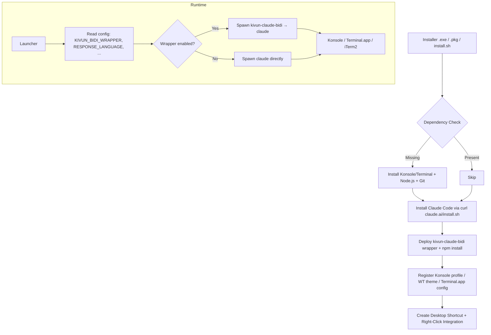

<table align="center" border="0" cellspacing="0" cellpadding="6"><tr>
<td valign="middle"></td>
<td valign="middle"><a href="#english"><b>English</b></a></td>
<td valign="middle"><b>|</b></td>
<td valign="middle"></td>
<td valign="middle"><a href="#%D7%A2%D7%91%D7%A8%D7%99%D7%AA"><b>עברית</b></a></td>
</tr></table>

<p align="center">
  
</p>

<p align="center">
  <video src="https://github.com/noambrand/kivun-terminal-wsl/releases/download/v1.1.0/kivun_terminal_Hebrew_demo.mp4" width="700" controls muted playsinline></video>
</p>

<p align="center">
  <em>📹 Demo: Hebrew Claude Code session inside Kivun Terminal -
  <a href="https://github.com/noambrand/kivun-terminal-wsl/releases/download/v1.1.0/kivun_terminal_Hebrew_demo.mp4">download MP4 (12 MB)</a>
  if your browser doesn't autoplay above.</em>
</p>

<p align="center">
  <a href="LICENSE"></a>
  
  
  
  <a href="https://github.com/noambrand/kivun-terminal-wsl/releases/latest"></a>
</p>

<h3 align="center">Real RTL Claude Code. Hebrew, Arabic, Persian, Urdu and 8 more - rendered correctly, on Windows, Linux, and macOS.</h3>

<p align="center">
  <a href="#quick-start">Quick Start</a> &bull;
  <a href="#why-kivun-terminal">Why Kivun Terminal?</a> &bull;
  <a href="#bidi-wrapper">BiDi Wrapper</a> &bull;
  <a href="#architecture">Architecture</a> &bull;
  <a href="#configuration">Configuration</a> &bull;
  <a href="docs/CHANGELOG.md">Changelog</a> &bull;
  <a href="docs/TROUBLESHOOTING.md">Troubleshooting</a>
</p>

---

## English

> 💡 **Working in English (LTR) only?** Check out the sister project **[ClaudeCode Launchpad CLI](https://github.com/noambrand/kivun-terminal)** - same launcher concept, faster startup (~2 s), no WSL needed. Kivun Terminal is the right pick when you need RTL/BiDi rendering for Hebrew, Arabic, Persian, etc.

## Why Kivun Terminal?

|  | Launchpad CLI v2.4.2 | Kivun Terminal v1.1.0 |
|---|---|---|
| **Runtime (Windows)** | Windows Terminal (native) | WSL2 + Ubuntu + Konsole |
| **RTL/BiDi rendering** | LTR only (Windows Terminal has no BiDi engine) | ✅ Full RTL + line-start RLM fix for Claude's bullet-line direction bug ([anthropics/claude-code#39881](https://github.com/anthropics/claude-code/issues/39881)) |
| **Supported RTL languages** | 0 | 11 (hebrew, arabic, persian, urdu, pashto, kurdish, dari, uyghur, sindhi, yiddish, syriac) |
| **Linux support** | Windows + macOS only (Linux planned) | ✅ apt / dnf / pacman / zypper |
| **macOS support** | ✅ .pkg | ✅ .pkg with BiDi wrapper |
| **Statusline** (model, context %, usage limits) | ✅ pre-installed | ✅ pre-installed (same `statusline.mjs`) |
| **Light-blue "Kivun" terminal theme** | ✅ Windows Terminal color scheme | ✅ Konsole `KivunTerminal` profile + `ColorSchemeNoam` |
| **Startup time** | ~2 s | ~6 s (Konsole launch) |
| **Install footprint (Windows)** | ~150 MB | ~2 GB (WSL + Ubuntu) |

## Quick Start

### Windows

1. **One-time WSL setup** (skip if `wsl --status` already prints WSL info): open **Terminal (Admin)**, run `wsl --install`, reboot.
2. **[Download `Kivun_Terminal_Setup.exe`](https://github.com/noambrand/kivun-terminal-wsl/releases/latest)**
3. Double-click to run - no admin rights needed once WSL is up.
4. Double-click the **Kivun Terminal** desktop shortcut, or right-click any folder → **Open with Kivun Terminal**.

> **Windows 11 - Smart App Control may block the installer.** If you see *"Smart App Control blocked an app that may be unsafe"* (clicking *Ok* dismisses it without an *override* option), the installer is unsigned and SAC won't allow unknown apps at all. To install: open **Start** → search **Smart App Control** → set it to **Off**. SAC cannot be re-enabled without reinstalling Windows, so leave it Off only if you're comfortable running other unsigned apps. See [SmartScreen warning](#windows-smartscreen) below for the milder warning you'll get with SAC off.

<a id="windows-smartscreen"></a>
> **Windows SmartScreen warning** (different from SAC): with SAC off, you may still see *"Windows protected your PC"*. Click **More info** → **Run anyway**. The installer is unsigned today; the warning will fade once enough downloads accumulate Microsoft's reputation signal.

### Linux

```bash
git clone https://github.com/noambrand/kivun-terminal-wsl.git
cd kivun-terminal-wsl
./linux/install.sh
```

Supports apt (Debian/Ubuntu), dnf (Fedora/RHEL), pacman (Arch/Manjaro), zypper (openSUSE). Installs Konsole, Node.js, Git, Claude Code, the BiDi wrapper, and right-click integrations for Nautilus + Dolphin.

### macOS

1. **[Download `Kivun_Terminal_Setup_mac.pkg`](https://github.com/noambrand/kivun-terminal-wsl/releases/latest)**
2. Double-click; allow in **System Settings → Privacy & Security**, then run again.
3. Use the **Kivun Terminal** desktop shortcut or right-click a folder → **Services → Open with Kivun Terminal**.

> First run requires a Claude Pro/Max subscription or an [Anthropic API key](https://console.anthropic.com).

## Status Bar

A two-line live status bar at the bottom of every Claude Code session - the same `statusline.mjs` ships in all three installers and registers into `~/.claude/settings.json` automatically:

> **MyProject** | 🟢 Sonnet 4.6 | Context 🟩🟩🟩🟩🟩⬜⬜⬜⬜⬜ 51% | tokens: 284K | 24:13
>
> Session 🟨🟨🟨🟨🟨🟨🟨🟨⬜⬜ 77% resets in 4h15m &nbsp;|&nbsp; Weekly 🟩🟩⬜⬜⬜⬜⬜⬜⬜⬜ 16% resets in 6d18h

| Field | What it shows |
|-------|---------------|
| **Model** | Active Claude model (color-coded: green = Opus, yellow = Sonnet/Haiku) |
| **Context** | % of context window consumed (green/yellow/red) |
| **Tokens** | Combined input + output tokens this session |
| **Session / Weekly** | Usage limit % with countdown to reset |

## Terminal Theme

A custom **light-blue Kivun color scheme** (`#C8E6FF` background, dark text, blue cursor) ships with every installer and is enabled by default:

| Platform | What gets configured | File |
|---|---|---|
| Windows (WSL+Konsole) | `KivunTerminal.profile` + `ColorSchemeNoam.colorscheme` | `~/.local/share/konsole/` (WSL) |
| Linux (Konsole) | Same profile + color scheme | `~/.local/share/konsole/` |
| macOS (Terminal.app) | Background / cursor / text colors set via osascript on launch | applied at runtime |

Disable via `TERMINAL_COLOR=default` in your config to fall back to the terminal emulator's defaults.

## BiDi Wrapper

v1.1.0 ships a `kivun-claude-bidi` Node.js wrapper that pipes Claude Code's output through a state machine doing two complementary fixes:

| Fix | What it does | Solves |
|---|---|---|
| **RLE/PDF bracketing** | Wraps every Hebrew run in U+202B / U+202C | Forces RTL direction within each run regardless of terminal BiDi profile |
| **Line-start RLM injection** | Inserts U+200F at the start of any line whose first strong char is RTL | Fixes Claude's `● שלום` first-line LTR bug ([anthropics/claude-code#39881](https://github.com/anthropics/claude-code/issues/39881)) |

Default-on across all three platforms. Toggle via `KIVUN_BIDI_WRAPPER=on|off` in your config. Test coverage: 18 injector unit fixtures + end-to-end smoke against a fake-claude stand-in via node-pty.

## Architecture



## Tech Stack

| Component | Technology | Purpose |
|-----------|-----------|---------|
| Windows installer | NSIS | Per-user install with WSL/Ubuntu/Konsole bootstrap |
| Linux installer | Bash + apt/dnf/pacman/zypper | Distro-aware package install + user-home deploy |
| macOS installer | pkgbuild | .pkg with postinstall via Homebrew |
| BiDi wrapper | Node.js + node-pty | Pipes Claude output through Unicode RLE/PDF/RLM state machine |
| Konsole profile | KDE Konsole `.profile` + `.colorscheme` | Light-blue Kivun theme + BidiEnabled=true |
| Language map | Shared `payload/languages.sh` | 23-language `--append-system-prompt` map sourced by all launchers |
| CI/CD | GitHub Actions | Automated Windows .exe + macOS .pkg + Linux .tar.gz builds on tag |

## Configuration

Per-platform config files (same schema across all three):

| Platform | Path |
|---|---|
| Windows | `%LOCALAPPDATA%\Kivun-WSL\config.txt` |
| Linux | `~/.config/kivun-terminal/config.txt` |
| macOS | `~/Library/Application Support/Kivun-Terminal/config.txt` |

```ini
RESPONSE_LANGUAGE=hebrew         # 23+ languages supported
TEXT_DIRECTION=rtl               # rtl or ltr
KIVUN_BIDI_WRAPPER=on            # on (default) or off
CLAUDE_FLAGS=                    # e.g. --continue
```

See `docs/CHANGELOG.md` for the full list of supported languages and config keys.

## Contributing

Contributions welcome. Areas where help is especially useful:

- **Wayland keyboard toggle** - `setxkbmap` is X11-only; Wayland needs DE-specific layout switching.
- **More RTL language coverage** - N'Ko, Adlam, Mandaic, and a few others currently fall back to Hebrew xkb layouts.
- **Integration testing** - different distros, different DEs, different macOS terminal emulators.

Fork the repo, make your changes, and open a PR.

## 🤝 Related projects in the RTL-for-AI-tools community

Five independent developers each built userland RTL fixes for five different surfaces. The fact that all of us had to ship our own fix is itself a comment on how overdue the upstream BiDi work is across the AI-tooling stack:

- **[Adaptive-RTL-Extension](https://github.com/Lidor-Mashiach/Adaptive-RTL-Extension)** by Lidor Mashiach — generic browser extension with click-to-select RTL for any website, including LLM chat UIs (Claude.ai, ChatGPT, Gemini, etc.).
- **[Claude.ai RTL Support (Chrome extension)](https://chromewebstore.google.com/detail/claude-ai-rtl-support/lkopcjdmfmffphbomfhecalbojiaeape)** — Chrome extension purpose-built for Claude.ai specifically. Lighter than the generic adaptive one if you only need RTL on Claude's web UI.
- **[rtl-for-vs-code-agents](https://github.com/GuyRonnen/rtl-for-vs-code-agents)** by Guy Ronnen — VS Code extension covering Claude Code, Cursor, Antigravity, and Gemini Code Assist in the VS Code webview layer.
- **[Claude-for-word-RTL-fix](https://github.com/asaf-aizone/Claude-for-word-RTL-fix)** by Asaf Aizone — Hebrew/Arabic RTL fix for the Claude for Word (Desktop) add-in.
- **[kivun-terminal-wsl](https://github.com/noambrand/kivun-terminal-wsl)** (this repo) — terminal-layer fix: a `kivun-claude-bidi` Node wrapper for Claude Code's TUI output, plus a one-click installer for WSL2+Konsole / Linux Konsole / macOS Terminal.

The five surfaces (generic browser DOM, Claude.ai web UI, VS Code webview, Microsoft Word, terminal) are disjoint — pick the one that matches where you're hitting the BiDi problem.

<div dir="rtl">

## עברית

> 💡 **עובדים רק באנגלית (LTR)?** הציצו בפרויקט האח **[ClaudeCode Launchpad CLI](https://github.com/noambrand/kivun-terminal)** - אותו קונספט שיגור, אתחול מהיר יותר (~2 שניות), בלי WSL. כיוון טרמינל מתאים כשצריך תמיכת RTL/BiDi בעברית, ערבית, פרסית וכד'.

### 🎯 מה זה?

כיוון טרמינל היא חבילת התקנה ושיגור עבור Claude Code עם תמיכה מלאה ב-RTL. רץ על Windows (דרך WSL2 + Konsole), Linux ו-macOS. הוא פותר את בעיית הצגת עברית/ערבית/פרסית/אורדו ועוד 7 שפות RTL ב-CLI של Claude Code, שלא נתמכות כראוי כברירת מחדל בטרמינלים מודרניים.

כיוון מתקין את Claude Code, מקנפג את הטרמינל לפרופיל המתאים, ומעביר את הפלט של Claude דרך wrapper ייעודי (`kivun-claude-bidi`) שמטפל בבעיות הכיוון של עברית - כולל הבאג המעצבן שגרם לשורה הראשונה בכל תגובה להופיע מיושרת לשמאל.

### ✨ במה זה שונה?

- **לעומת Claude Code ב-Windows Terminal:** ל-Windows Terminal אין מנוע BiDi כלל; כל פלט עברי מוצג LTR וקרוס. כיוון מריץ את הפלט דרך WSL2 + Konsole, שכן יש לה מנוע BiDi מלא.
- **לעומת WSL2 + Konsole "גולמי":** מאפשר התקנה בקליק אחד, פרופיל Konsole מוכן עם הצבעים הנכונים, סטטוסליין, החלפת שפה ב-Alt+Shift, וה-`kivun-claude-bidi` wrapper שפותר את בעיות ה-BiDi הספציפיות של Claude Code (לדוגמה הבאג של bullet line).
- **לעומת Claude Code ב-VS Code:** כיוון הוא לטרמינל, לא ל-IDE. אם אתם עובדים בעיקר משורת פקודה - זה מה שאתם רוצים. למי שעובד מ-IDE יש פתרון נפרד של [גיא רונן](https://github.com/GuyRonnen/rtl-for-vs-code-agents) (ראו פרויקטים קשורים למטה).

### 🚀 פיצ'רים

- ✅ הצגה תקינה של עברית/ערבית/פרסית/אורדו ועוד 7 שפות RTL בפלט של Claude Code
- ✅ תיקון לבאג של השורה הראשונה (`● שלום` היה מופיע משמאל לימין; עכשיו מימין לשמאל)
- ✅ פרופיל Konsole בצבעי Kivun (תכלת בהיר, נעים לעין)
- ✅ סטטוסליין חי בתחתית המסך (מודל פעיל, אחוז קונטקסט, מגבלות שימוש)
- ✅ קיצור דרך לשולחן העבודה + תפריט קליק ימני על תיקיות
- ✅ Folder picker - בחירת תיקיית עבודה לפני ההפעלה
- ✅ Alt+Shift להחלפה בין עברית לאנגלית בתוך הטרמינל
- ✅ נתמך על Windows, Linux (apt/dnf/pacman/zypper) ו-macOS

### 📥 התקנה

הוראות ההתקנה מפורטות באנגלית בקטעי **Quick Start** למעלה. הפקודות (`npm install`, נתיבים וכד') זהות בכל השפות ולא תורגמו. בקצרה:

<ul dir="rtl" align="right">
<li><strong>Windows:</strong> <code>wsl --install</code> חד-פעמי, אז להוריד את <code>Kivun_Terminal_Setup.exe</code> מ-<a href="https://github.com/noambrand/kivun-terminal-wsl/releases/latest">הגרסה האחרונה</a> ולהריץ.</li>
<li><strong>Linux:</strong> <code>git clone</code> + <code>./linux/install.sh</code>. תומך ב-apt/dnf/pacman/zypper.</li>
<li><strong>macOS:</strong> להוריד את <code>Kivun_Terminal_Setup_mac.pkg</code> ולהריץ.</li>
</ul>

<blockquote dir="rtl" align="right">
<strong>Windows 11 - Smart App Control חוסם את ההתקנה.</strong> אם רואים <em>"Smart App Control blocked an app that may be unsafe"</em> בלי כפתור עקיפה - SAC לא מאפשר אפליקציות לא חתומות בכלל. כדי להתקין: פותחים <strong>Start</strong> ← מחפשים <strong>Smart App Control</strong> ← מעבירים ל-<strong>Off</strong>. אי אפשר להפעיל מחדש את SAC בלי התקנה מחדש של Windows, אז להשאיר Off רק אם זה בסדר עבורכם להריץ אפליקציות לא חתומות אחרות. אחרי שמכבים את SAC, ייתכן שעדיין תופיע אזהרת SmartScreen <em>"Windows protected your PC"</em> - לוחצים <strong>More info</strong> ואז <strong>Run anyway</strong>.
</blockquote>

### 🧠 על תמיכת ה-RTL

ה-wrapper `kivun-claude-bidi` הוא מודול Node שמלפף סביב Claude Code. הוא מזהה רצפי טקסט בעברית בפלט ועוטף אותם בסימני BiDi של Unicode (RLE/PDF), כך שהם מוצגים בכיוון הנכון גם בטרמינלים שתמיכת ה-BiDi שלהם חלקית. בנוסף, הוא מחדיר RLM (U+200F) בתחילת כל שורה שהאות החזקה הראשונה שלה היא RTL - מה שמתקן את הבאג ב-Claude Code שבו `● שלום` היה מופיע משמאל לימין במקום מימין לשמאל.

לפירוט מלא של האלגוריתם, ראו [`docs/specs/BIDI_ALGORITHM.md`](docs/specs/BIDI_ALGORITHM.md). למעקב אחרי הבאג ב-upstream של Anthropic, ראו [anthropics/claude-code#39881](https://github.com/anthropics/claude-code/issues/39881). אם אתם רוצים לתרום תיעוד עברי לריפו הזה, יש מדריך מעשי ב-[`docs/HEBREW_RTL_GITHUB.md`](docs/HEBREW_RTL_GITHUB.md) על איך לכתוב עברית שתעבוד נכון ב-GitHub.

### 🤝 פרויקטים קשורים בקהילת RTL-for-AI-tools

חמישה מפתחים עצמאיים בנו פתרונות RTL לחמש סביבות שונות. העובדה שכולנו נאלצנו לכתוב פתרון userland נפרד מעידה לבדה על כמה זמן זה כבר נדחה ב-upstream:

<ul dir="rtl" align="right">
<li><strong><a href="https://github.com/Lidor-Mashiach/Adaptive-RTL-Extension">Adaptive-RTL-Extension</a></strong> מאת לידור משיח - הרחבת דפדפן גנרית עם click-to-select ל-RTL בכל אתר, כולל ממשקי צ'אט של מודלי שפה.</li>
<li><strong><a href="https://chromewebstore.google.com/detail/claude-ai-rtl-support/lkopcjdmfmffphbomfhecalbojiaeape">Claude.ai RTL Support (הרחבת Chrome)</a></strong> - הרחבה ל-Chrome ייעודית ל-Claude.ai. קלה יותר מהגנרית אם אתם צריכים RTL רק על ממשק הווב של Claude.</li>
<li><strong><a href="https://github.com/GuyRonnen/rtl-for-vs-code-agents">rtl-for-vs-code-agents</a></strong> מאת גיא רונן - הרחבה ל-VS Code עבור Claude Code, Cursor, Antigravity ו-Gemini Code Assist בשכבת ה-webview.</li>
<li><strong><a href="https://github.com/asaf-aizone/Claude-for-word-RTL-fix">Claude-for-word-RTL-fix</a></strong> מאת אסף אייזון - תיקון RTL לעברית/ערבית עבור תוסף Claude ל-Microsoft Word (Desktop).</li>
<li><strong><a href="https://github.com/noambrand/kivun-terminal-wsl">kivun-terminal-wsl</a></strong> (הפרויקט הזה) - תיקון בשכבת הטרמינל.</li>
</ul>

חמש הסביבות (DOM של דפדפן גנרי, ממשק הווב של Claude.ai, webview של VS Code, Microsoft Word, טרמינל) נפרדות זו מזו - בחרו את הפתרון שמתאים למקום שבו אתם נתקלים בבעיית ה-BiDi.

</div>

## License

[MIT](LICENSE)

---

<p align="center">
  <strong>Made by <a href="https://github.com/noambrand">Noam Brand</a></strong>
  <br><br>
  <a href="https://github.com/noambrand"></a>
  <a href="https://www.linkedin.com/in/noambrand/"></a>
  <a href="https://www.facebook.com/noambbb/"></a>
  <a href="mailto:noambbb@gmail.com"></a>
</p>
