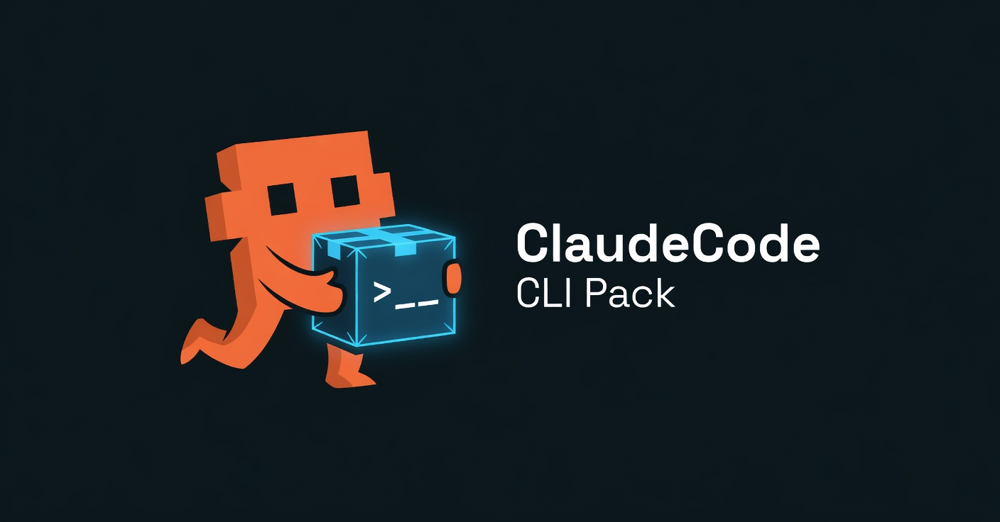
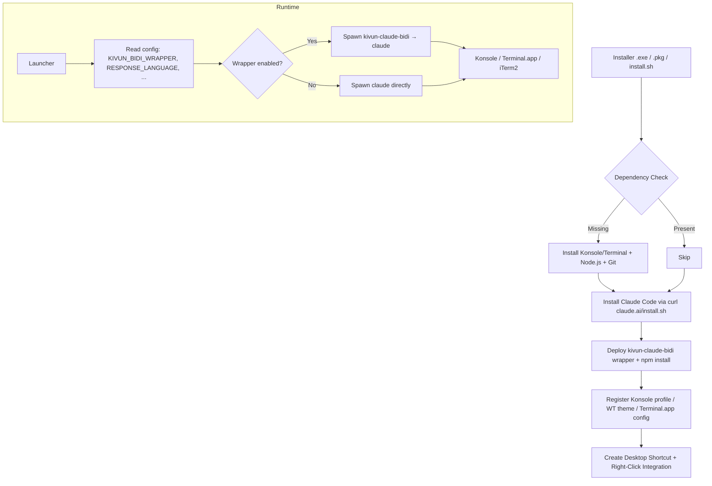

<p align="center">
  
</p>

<p align="center">
  <video src="https://github.com/noambrand/kivun-terminal-wsl/releases/download/v1.1.0/kivun_terminal_Hebrew_demo.mp4" width="700" controls muted playsinline></video>
</p>

<p align="center">
  <em>📹 Demo: Hebrew Claude Code session inside Kivun Terminal -
  <a href="https://github.com/noambrand/kivun-terminal-wsl/releases/download/v1.1.0/kivun_terminal_Hebrew_demo.mp4">download MP4 (12 MB)</a>
  if your browser doesn't autoplay above.</em>
</p>

<p align="center">
  <a href="LICENSE"></a>
  
  
  
  <a href="https://github.com/noambrand/kivun-terminal-wsl/releases/latest"></a>
</p>

<h3 align="center">Real RTL Claude Code. Hebrew, Arabic, Persian, Urdu and 8 more - rendered correctly, on Windows, Linux, and macOS.</h3>

<p align="center">
  <a href="#quick-start">Quick Start</a> &bull;
  <a href="#why-kivun-terminal">Why Kivun Terminal?</a> &bull;
  <a href="#bidi-wrapper">BiDi Wrapper</a> &bull;
  <a href="#architecture">Architecture</a> &bull;
  <a href="#configuration">Configuration</a> &bull;
  <a href="docs/CHANGELOG.md">Changelog</a> &bull;
  <a href="docs/TROUBLESHOOTING.md">Troubleshooting</a>
</p>

---

> 💡 **Working in English (LTR) only?** Check out the sister project **[ClaudeCode Launchpad CLI](https://github.com/noambrand/kivun-terminal)** - same launcher concept, faster startup (~2 s), no WSL needed. Kivun Terminal is the right pick when you need RTL/BiDi rendering for Hebrew, Arabic, Persian, etc.

## Why Kivun Terminal?

|  | Launchpad CLI v2.4.2 | Kivun Terminal v1.1.0 |
|---|---|---|
| **Runtime (Windows)** | Windows Terminal (native) | WSL2 + Ubuntu + Konsole |
| **RTL/BiDi rendering** | LTR only (Windows Terminal has no BiDi engine) | ✅ Full RTL + line-start RLM fix for Claude's bullet-line direction bug ([anthropics/claude-code#39881](https://github.com/anthropics/claude-code/issues/39881)) |
| **Supported RTL languages** | 0 | 11 (hebrew, arabic, persian, urdu, pashto, kurdish, dari, uyghur, sindhi, yiddish, syriac) |
| **Linux support** | Windows + macOS only (Linux planned) | ✅ apt / dnf / pacman / zypper |
| **macOS support** | ✅ .pkg | ✅ .pkg with BiDi wrapper |
| **Statusline** (model, context %, usage limits) | ✅ pre-installed | ✅ pre-installed (same `statusline.mjs`) |
| **Light-blue "Kivun" terminal theme** | ✅ Windows Terminal color scheme | ✅ Konsole `KivunTerminal` profile + `ColorSchemeNoam` |
| **Startup time** | ~2 s | ~6 s (Konsole launch) |
| **Install footprint (Windows)** | ~150 MB | ~2 GB (WSL + Ubuntu) |

## Quick Start

### Windows

1. **One-time WSL setup** (skip if `wsl --status` already prints WSL info): open **Terminal (Admin)**, run `wsl --install`, reboot.
2. **[Download `Kivun_Terminal_Setup.exe`](https://github.com/noambrand/kivun-terminal-wsl/releases/latest)**
3. Double-click to run - no admin rights needed once WSL is up.
4. Double-click the **Kivun Terminal** desktop shortcut, or right-click any folder → **Open with Kivun Terminal**.

### Linux

```bash
git clone https://github.com/noambrand/kivun-terminal-wsl.git
cd kivun-terminal-wsl
./linux/install.sh
```

Supports apt (Debian/Ubuntu), dnf (Fedora/RHEL), pacman (Arch/Manjaro), zypper (openSUSE). Installs Konsole, Node.js, Git, Claude Code, the BiDi wrapper, and right-click integrations for Nautilus + Dolphin.

### macOS

1. **[Download `Kivun_Terminal_Setup_mac.pkg`](https://github.com/noambrand/kivun-terminal-wsl/releases/latest)**
2. Double-click; allow in **System Settings → Privacy & Security**, then run again.
3. Use the **Kivun Terminal** desktop shortcut or right-click a folder → **Services → Open with Kivun Terminal**.

> First run requires a Claude Pro/Max subscription or an [Anthropic API key](https://console.anthropic.com).

## Status Bar

A two-line live status bar at the bottom of every Claude Code session - the same `statusline.mjs` ships in all three installers and registers into `~/.claude/settings.json` automatically:

> **MyProject** | 🟢 Sonnet 4.6 | Context 🟩🟩🟩🟩🟩⬜⬜⬜⬜⬜ 51% | tokens: 284K | 24:13
>
> Session 🟨🟨🟨🟨🟨🟨🟨🟨⬜⬜ 77% resets in 4h15m &nbsp;|&nbsp; Weekly 🟩🟩⬜⬜⬜⬜⬜⬜⬜⬜ 16% resets in 6d18h

| Field | What it shows |
|-------|---------------|
| **Model** | Active Claude model (color-coded: green = Opus, yellow = Sonnet/Haiku) |
| **Context** | % of context window consumed (green/yellow/red) |
| **Tokens** | Combined input + output tokens this session |
| **Session / Weekly** | Usage limit % with countdown to reset |

## Terminal Theme

A custom **light-blue Kivun color scheme** (`#C8E6FF` background, dark text, blue cursor) ships with every installer and is enabled by default:

| Platform | What gets configured | File |
|---|---|---|
| Windows (WSL+Konsole) | `KivunTerminal.profile` + `ColorSchemeNoam.colorscheme` | `~/.local/share/konsole/` (WSL) |
| Linux (Konsole) | Same profile + color scheme | `~/.local/share/konsole/` |
| macOS (Terminal.app) | Background / cursor / text colors set via osascript on launch | applied at runtime |

Disable via `TERMINAL_COLOR=default` in your config to fall back to the terminal emulator's defaults.

## BiDi Wrapper

v1.1.0 ships a `kivun-claude-bidi` Node.js wrapper that pipes Claude Code's output through a state machine doing two complementary fixes:

| Fix | What it does | Solves |
|---|---|---|
| **RLE/PDF bracketing** | Wraps every Hebrew run in U+202B / U+202C | Forces RTL direction within each run regardless of terminal BiDi profile |
| **Line-start RLM injection** | Inserts U+200F at the start of any line whose first strong char is RTL | Fixes Claude's `● שלום` first-line LTR bug ([anthropics/claude-code#39881](https://github.com/anthropics/claude-code/issues/39881)) |

Default-on across all three platforms. Toggle via `KIVUN_BIDI_WRAPPER=on|off` in your config. Test coverage: 18 injector unit fixtures + end-to-end smoke against a fake-claude stand-in via node-pty.

## Architecture



## Tech Stack

| Component | Technology | Purpose |
|-----------|-----------|---------|
| Windows installer | NSIS | Per-user install with WSL/Ubuntu/Konsole bootstrap |
| Linux installer | Bash + apt/dnf/pacman/zypper | Distro-aware package install + user-home deploy |
| macOS installer | pkgbuild | .pkg with postinstall via Homebrew |
| BiDi wrapper | Node.js + node-pty | Pipes Claude output through Unicode RLE/PDF/RLM state machine |
| Konsole profile | KDE Konsole `.profile` + `.colorscheme` | Light-blue Kivun theme + BidiEnabled=true |
| Language map | Shared `payload/languages.sh` | 23-language `--append-system-prompt` map sourced by all launchers |
| CI/CD | GitHub Actions | Automated Windows .exe + macOS .pkg + Linux .tar.gz builds on tag |

## Configuration

Per-platform config files (same schema across all three):

| Platform | Path |
|---|---|
| Windows | `%LOCALAPPDATA%\Kivun-WSL\config.txt` |
| Linux | `~/.config/kivun-terminal/config.txt` |
| macOS | `~/Library/Application Support/Kivun-Terminal/config.txt` |

```ini
RESPONSE_LANGUAGE=hebrew         # 23+ languages supported
TEXT_DIRECTION=rtl               # rtl or ltr
KIVUN_BIDI_WRAPPER=on            # on (default) or off
CLAUDE_FLAGS=                    # e.g. --continue
```

See `docs/CHANGELOG.md` for the full list of supported languages and config keys.

## Contributing

Contributions welcome. Areas where help is especially useful:

- **Wayland keyboard toggle** - `setxkbmap` is X11-only; Wayland needs DE-specific layout switching.
- **More RTL language coverage** - N'Ko, Adlam, Mandaic, and a few others currently fall back to Hebrew xkb layouts.
- **Integration testing** - different distros, different DEs, different macOS terminal emulators.

Fork the repo, make your changes, and open a PR.

## License

[MIT](LICENSE)

---

<p align="center">
  <strong>Made by <a href="https://github.com/noambrand">Noam Brand</a></strong>
  <br><br>
  <a href="https://github.com/noambrand"></a>
  <a href="mailto:noambbb@gmail.com"></a>
</p>
